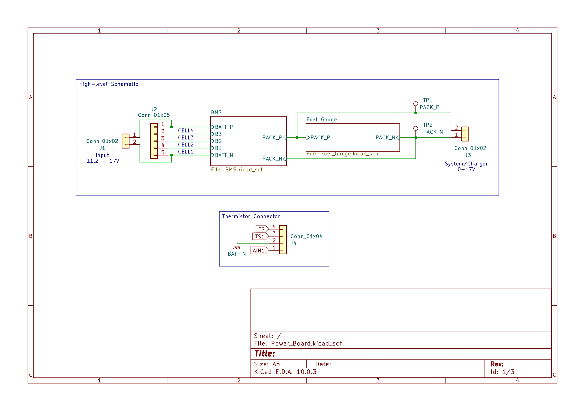
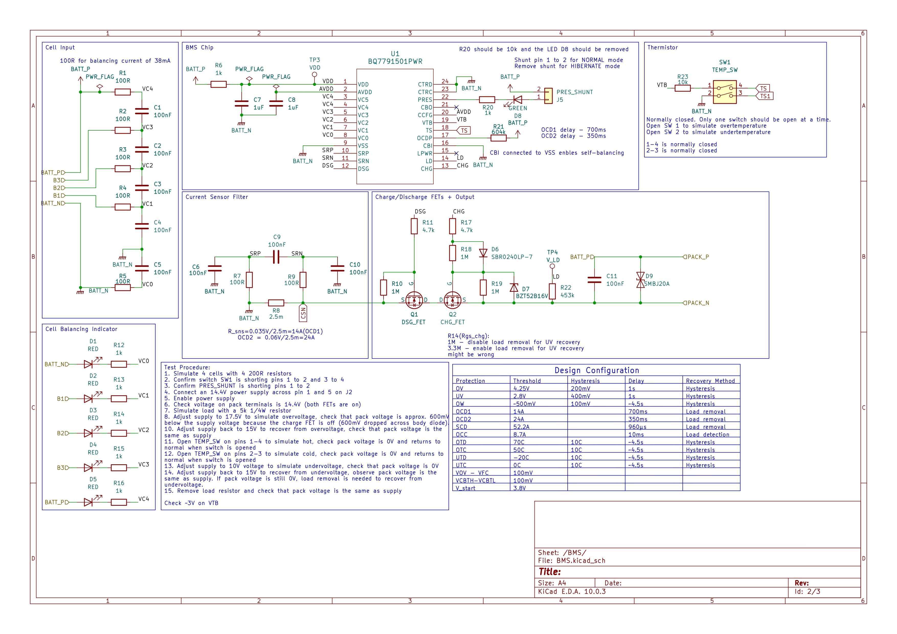
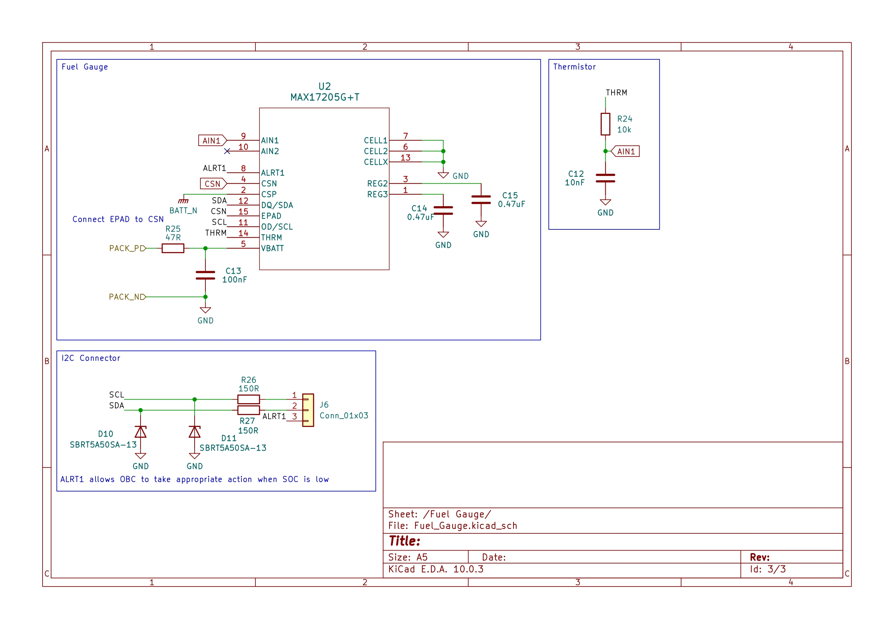
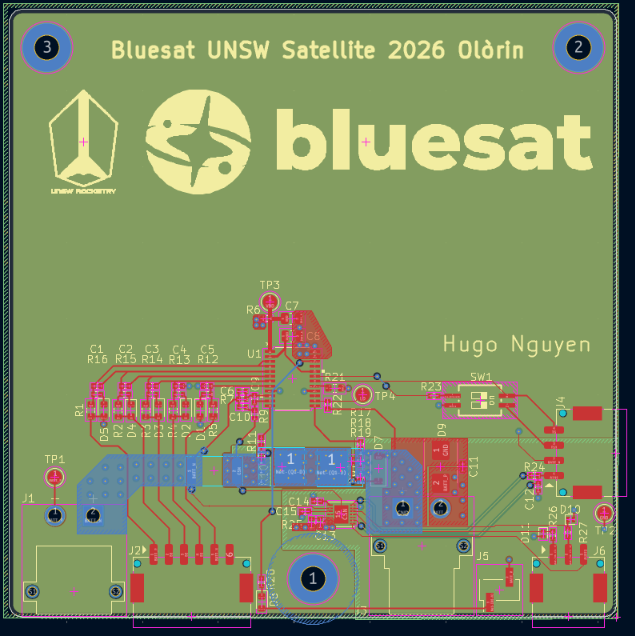
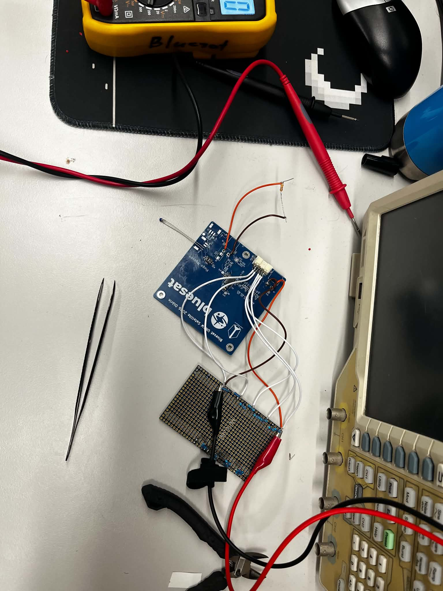

# What is it?

This is a **BMS board** I designed for UNSW Bluesat's Cubesat as part of the **Australian Universities Rocket Competition (AURC)** which takes place in September 2027.

The **USB-C PD charger** is implemented on a separate board due to time constraint before the competition deadline.

The **BQ7791501** is a 3-5 cell stackable, ultra-low power battery pack protector with autonomous cell-balancing and hibernate mode. **Hibernate mode** is important to conserve battery life during long transit and standby time until the launch signal.

<table>
  <tr>
    <td></td>
    <td></td>
  </tr>
  <tr>
    <td></td>
    <td></td>
  </tr>
  <tr>
    <td></td>
    <td></td>
  </tr>
</table>

## Technical

The two main loads are:
- **32 UV LEDs** to cure the resin of the Cubesat's 3D printer payload: In the worst-case, where battery pack voltage is near cut-off and LEDs are at set to output max power, they will draw around **8.5A** continuously
- **Stepper motor**: draws around 0.86A continuously and 1.06A peak

-> **Total current = 8.5A + 1.06A = 9.56A**

**OC1** is set to be **14A at 700ms**, this was chosen due to availability of the sense resistor values and should give us **~30% margin**. However, there is a tolerance of **± 20%** so it could be anywhere between **11.2A to 16.8A**.

**OC2**, as a result, is set at **24A at 350ms**.

The sense resistor is **2.5 mOhms with 0.5% tolerance** (instead of the regular 1%) for accurate current reading. **Kelvin connection** was used so the 2 sense traces carry minimum current. It is also rated up to **3W**, which is well above the calculated power dissipation of **1.44W** at OCD2 current of 24A.

A pair of switches was added to simulate a **hot/cold condition**, which assists in verifying the proper working of the BMS.

A **filter network** was placed close to the sense pins of the protector IC helps to filter noise out of the current reading.

A **jumper shunt** can be removed to enter **hibernate mode**.

## Status

The BMS board is working, **thoroughly verified**, in particular **OV, UV, OTD, UTD, OTC, UTC**.

**OCD1, OCD2, and OCC** is to be verified by using a larger sense resistor value to lower the overcurrent threshold. It is currently too high for the power supply's output current capability.

**Cell-balancing** has also been verified to work.
